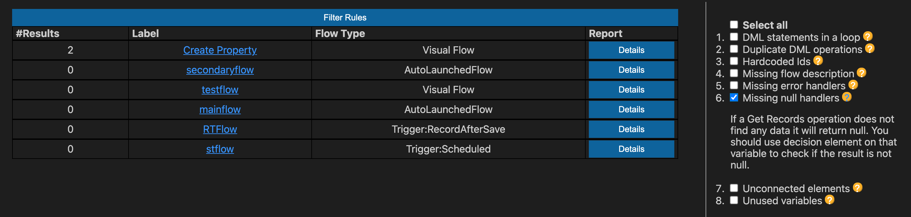

__*Identify potential issues and improvements in Salesforce Flows*__

**Also available as [SFDX Plugin](https://github.com/Force-Config-Control/lightning-flow-scanner-sfdx)*

## Table of contents

- [Using the commands](#Using-the-commands)
- [Scan Flows](#Scan-Flows)
- [Fix Flows](#Fix-Flows)
- [Rule overview](#rule-overview)
- [Configuration](#configuration)

## Using the commands

Open the **Command Palette** and type `Flow` to see the list of all available commands.

## Scan Flows

Use the scan command to run analysis on a selection of flows

## Fix Flows

Use the fix command to apply available fixes automatically.  

## Rule Overview

| Rule       | Id | Description |
|--------------|:-----:|:-----------|
| **DML statements in a loop** |  DMLStatementInLoop | To avoid hitting Apex governor limits, we recommend grouping all of your database changes together at the end of the flow, whether those changes create, update, or delete records. |
| **Duplicate DML operations** |  DuplicateDMLOperations | If the flow commits changes to the database or performs actions between two screens, don't let users navigate back between screen. Otherwise, the flow may perform duplicate database operations. |
| **Hardcoded Ids** | HardcodedIds | IDs are org-specific, so don’t hard-code IDs. Instead, pass them into variables when the flow starts. You can do so, for example, by using merge fields in URL parameters or by using a Get Records element. |
| **Missing flow description** |  MissingFlowDescription | Descriptions are useful for documentation purposes. It is recommended to provide information about where it is used and what it will do. |
| **Missing error handlers** |  MissingFaultPath | Sometimes a flow doesn’t perform an operation that you configured it to do. By default, the flow shows an error message to the user and emails the admin who created the flow. However, you can control that behavior. |
| **Missing null handlers**      |  MissingNullHandler | If a Get Records operation does not find any data it will return null. Use a decision element on the operation result variable to validate that the result is not null. |
| **Unconnected elements** |  UnconnectedElements | Unconnected elements which are not being used by the Flow should be avoided to keep Flows efficient and maintainable. |
| **Unused variables**      |  UnusedVariables | Unused variables which are not being used by the Flow should be avoided to keep Flow more efficient and maintainable. |

**More information on the rules can be found in the [lfs-core module documentation](https://github.com/Force-Config-Control/lightning-flow-scanner-core).*

## Configuration

If you want to specify folders instead of files, go to:
   settings:extensions -> lightning flow scanner, specify files.