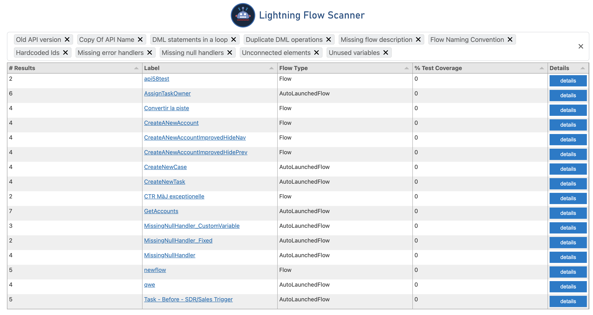
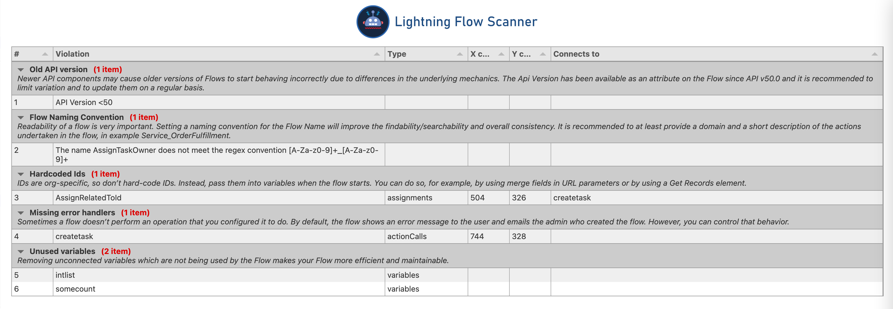

__*Identify potential issues and improvements in Salesforce Flows*__

**Also available as [SFDX Plugin](https://github.com/Force-Config-Control/lightning-flow-scanner-sfdx)*

## Using the commands

Open the **Command Palette** and type `Flow` to see the list of all available commands.

### Scan Flows

Use the `Scan Flows` command by choosing either a directory or a selection of flows to run the analysis on.

### Fix Flows

Use the `Fix Flows` command to apply available fixes automatically.  

### View Default Flow Rules

The `View Default Flow Rules` command can be used to view more details on the rules that are applied to Flows in the scans. 

## Rule Overview

| Rule       | Description |
|--------------|:-----------|
| **Old API version** | Newer API components may cause older versions of Flows to start behaving incorrectly due to differences in the underlying mechanics. The Api Version has been available as an attribute on the Flow since API v50.0 and it is recommended to limit variation and to update them on a regular basis. |
| **Copy of API Name** | Having multiple elements called Copy_X_Of_Element will decrease the readability of the Flow. If you copy and paste them, make sure to update the API name of the new copy. |
| **DML statements in a loop** |  To avoid hitting Apex governor limits, we recommend grouping all of your database changes together at the end of the flow, whether those changes create, update, or delete records. |
| **Duplicate DML operations** |   If the flow commits changes to the database or performs actions between two screens, don't let users navigate back between screen. Otherwise, the flow may perform duplicate database operations. |
| **Hardcoded Ids** |  IDs are org-specific, so don’t hard-code IDs. Instead, pass them into variables when the flow starts. You can do so, for example, by using merge fields in URL parameters or by using a Get Records element. |
| **Flow naming conventions** |  Readability of a flow is very important. Setting a naming convention for the Flow Name will improve the findability/searchability and overall consistency. It is recommended to at least provide a domain and a short description of the actions undertaken in the flow, in example Service_OrderFulfillment. |
| **Missing flow description** |   Descriptions are useful for documentation purposes. It is recommended to provide information about where it is used and what it will do. |
| **Missing error handlers** |  Sometimes a flow doesn’t perform an operation that you configured it to do. By default, the flow shows an error message to the user and emails the admin who created the flow. However, you can control that behavior. |
| **Missing null handlers**      |   If a Get Records operation does not find any data it will return null. Use a decision element on the operation result variable to validate that the result is not null. |
| **Unconnected elements** |  Unconnected elements which are not being used by the Flow should be avoided to keep Flows efficient and maintainable. |
| **Unused variables**      |  Unused variables which are not being used by the Flow should be avoided to keep Flow more efficient and maintainable. |

**More information on the rules can be found in the [lfs-core module documentation](https://github.com/Force-Config-Control/lightning-flow-scanner-core).*

## Settings
 Name        | Description | Type | Default value | 
|--------------|:-----------|--------------|:-----------|
| SpecifyFlows | Specify flow file paths instead of a root directory. | boolean | false | 
| NamingConvention | Specify a REGEX expression to use as Flow Naming convention. | string | [A-Za-z0-9]+_[A-Za-z0-9]+ | 
| APIVersion | Specify an expression to validate the API version, i.e. '===50'(use at least 50). | string | >50 | 
